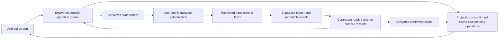

# Sadid: authoritative Supabase ledger, secure offline synchronization, and realistic test store

Prepared: 2026-10-10. User timezone: Asia/Hebron.

## 1. How to use this handoff

This document is the implementation specification and context handoff for the conversation that produced it. A new chat or a less expensive coding model should read it before changing the project. It intentionally distinguishes approved requirements, verified current implementation, proposed engineering details, and unresolved questions.

The request in the turn that produced this document was **to write a comprehensive plan**, not to execute the remaining implementation. Read-only inspection was performed to verify the current state. No ledger migration, permanent seed, new admin, or Android sync implementation was executed during this planning turn.

On a subsequent request to implement this plan, proceed through the phases below. Do not ask the user to choose again among decisions recorded as agreed. Ask only about genuine unresolved choices or missing access. The user is pressed for time, dislikes repeated confirmation, and requested remaining questions together. Bundle essential open questions; continue independent preparation where possible.

Backend correctness, database authorization, financial integrity, and durability are the highest priorities. Android UI improvements are lower priority. Minimum Android integration is still needed to demonstrate the actual backend and to retire unsafe legacy synchronization.

## 2. Project purpose and identities

Sadid / Sadad / سدد is an Arabic RTL store debt-ledger application. Repository and package names often use `Sadad`; the user calls the product `Sadid`. Preserve existing names where renaming is unnecessary.

The app tracks contacts, debts owed to the store, debts owed by the store, payments, remaining balances, transaction history, and reports. Existing Android assets are Arabic; store currency is ILS. There is also a newer Flutter implementation in the repository, but the user explicitly selected the native Java Android app for the Auth work. Do not switch implementation targets silently.

### Important locations

| Item | Absolute path or identifier |
|---|---|
| Actual Git project | `C:\Users\Lenovo\Documents\ChatGPT\سدد` |
| Native Android project | `C:\Users\Lenovo\Documents\ChatGPT\سدد\Supabase-Setup\android-official\Sadad-AndroidStudio` |
| Android Java package | `app/src/main/java/com/sadad/app` beneath the native Android project |
| Android screens and JS | `app/src/main/assets/screens` and `app/src/main/assets/app.js` |
| Supabase source | `C:\Users\Lenovo\Documents\ChatGPT\سدد\Supabase-Setup\supabase` |
| Admin source | `C:\Users\Lenovo\Documents\ChatGPT\سدد\Supabase-Setup\admin\Sadad-Admin-Server` |
| Flutter app, secondary reference | `C:\Users\Lenovo\Documents\ChatGPT\سدد\Sadad-Flutter` |
| Prior implementation plan | `C:\Users\Lenovo\Documents\ChatGPT\سدد\Supabase-Setup\IMPLEMENTATION_PLAN.md` |
| Migration/recovery runbook | `C:\Users\Lenovo\Documents\ChatGPT\سدد\Supabase-Setup\docs\MIGRATION_AND_RECOVERY.md` |
| Auth implementation notes | `C:\Users\Lenovo\Documents\ChatGPT\سدد\Supabase-Setup\docs\ANDROID_AUTH.md` |
| This chat workspace | `C:\Users\Lenovo\Documents\Codex\2026-10-10\supabase-plugin-supabase-openai-curated-remote` |
| Deliverables directory | `C:\Users\Lenovo\Documents\Codex\2026-10-10\supabase-plugin-supabase-openai-curated-remote\outputs` |
| Connected Supabase project | `sadid`, ref `vhftjmiltqfwmrszdtgf` |
| Supabase API URL | `https://vhftjmiltqfwmrszdtgf.supabase.co` |
| Current Android gateway | `https://vhftjmiltqfwmrszdtgf.supabase.co/functions/v1/sadad-auth/api` |
| Existing business API | `https://vhftjmiltqfwmrszdtgf.supabase.co/functions/v1/sadad-api/api` |

The actual project differs from the current chat working directory. Set tool working directories explicitly. The repository has substantial untracked directories, including `Supabase-Setup`, `Sadad-Flutter`, `.local-tools`, and an Arabic delivery directory. Preserve them. An empty Git diff does not prove there are no local changes. Recheck `git status` and instructions before work; do not reset or delete user files.

## 3. What is already implemented and what is not

### Verified live state at planning time

Read-only queries on 2026-10-10 found:

- Zero `auth.users`, zero `public.stores`, zero `public.admins`, and zero `public.sadad_auth_bindings` rows.
- Zero public `ledger_*` tables.
- Neither `sadad_v3_apply` nor `sadad_v3_snapshot` exists in the public function catalog.
- `sadad-api` is active at deployed version 2.
- `sadad-auth` is active at deployed version 2.
- Both Edge Functions currently have gateway JWT verification disabled. Their handlers perform their own authentication because login and refresh require public entry points. This is existing configuration, not permission to leave private routes unprotected.
- Existing public tables have RLS enabled: `admins`, `audit_events`, `contact_archives`, `contacts`, `debts`, `login_rate_limits`, `payments`, `sadad_auth_bindings`, `sessions`, `store_backups`, `store_devices`, `stores`.
- The prior security advisor reported informational “RLS Enabled No Policy” notices for service-only tables. That describes the old architecture; the new user-scoped RLS design still needs implementation.
- Migration history includes the older snapshot/admin/session migrations and `sadad_android_auth_bindings`. The local v3 foundation migration is not installed live.

Reinspect before execution. State may change after this document. A currently empty hosted database does not prove there is no real data on an old handset, Node server, or delivery archive.

### Existing Auth gateway

`supabase/functions/sadad-auth/{index.ts,handler.ts,handler_test.ts,deno.json,deno.lock}` implements:

1. Store-number/password verification through the deployed `sadad-api`.
2. Supabase Auth identity/session creation through server-side `generateLink` and `verifyOtp`.
3. An opaque internal email derived using an HMAC of store identity with the server credential. No email is sent. Store passwords remain in Sadid's legacy password system.
4. Verification of Supabase access JWTs through Auth `getUser`.
5. Binding of a legacy device session to the exact Auth user and Auth session ID.
6. Private requests require the Auth bearer plus `X-Sadad-Session`; the business API rechecks store/device status.
7. Refresh checks the binding and current device/store session.
8. Logout deletes the binding and revokes the local Auth session.
9. Temporary passwords block business routes until changed.

`sadad_auth_bindings` stores `session_hash`, `user_id`, `auth_session_id`, `store_id`, expiry, and creation time. Only service_role has table privileges. The local migration is `20261010083726_sadad_android_auth_bindings.sql`; the live migration history timestamp is `20261010083959`. Do not apply the local file again just because those timestamps differ; inspect actual schema/history.

Supabase JS for the gateway is pinned to `2.117.3` with a lockfile. The first-user token verification bug was corrected to `type: "email"` so the generated signup token is accepted as well as an existing-user email token. An Edge redeploy once failed by inheriting an absolute import-map path; explicitly provide `import_map_path: "deno.json"` when redeploying.

This Auth bridge is working, but **it is not the approved final RLS, installation-proof, or v3 ledger architecture**. In particular, the business API uses service-role database access. Do not claim that passing a user JWT to the outer gateway makes downstream service-role queries enforce that user's RLS.

### Existing Android behavior

`MainActivity.java` currently opens `SadadDatabase`, the SQLite `sadad.db` v2 ledger. It writes contacts/debts/payments directly into that database. Screens read its snapshots and compute balances locally. After a write, `scheduleSync()` uploads the entire local snapshot to `mobile/sync`, with `baseRevision`.

Login/password-change flows import remote snapshots. Some empty-server flows can upload an existing local ledger. The Auth work added an ownership guard to refuse automatic use of local contacts belonging to another store or an unknown owner. This is a guard, not a complete data migration.

The current implementation does not connect a durable per-operation outbox to `MainActivity`. There is no complete continuous pull/reconciliation pipeline for authoritative server changes. Failed queued background attempts are not equivalent to a durable, inspectable command journal.

`SessionStore.java` encrypts the Auth access/refresh tokens and the legacy device credential in Android Keystore AES-GCM storage. Native route and data-method guards, lock checks, refresh-on-request, and redirects after rejection were added. The API URL is fixed by the build rather than changeable on the sign-in screen. Login supplies a persistent device UUID and optional staff name.

The current legacy device-session lifetime is roughly 12 hours. That is not the newly approved seven-day offline authorization policy. Do not extend access JWT expiry to seven days to emulate an offline lease.

### Prepared code that must not be mistaken for completed features

- `SyncDatabase.java` defines Room `confirmed_cache` and `command_journal` entities in `sadad-sync-v3.db`, but `MainActivity` does not use them.
- `ApiClient.java` is a prepared transport helper; inspect its callers before relying on it.
- `202610050001_ledger_foundation.sql` defines local v3 structures, legacy guards, and immutable-history helpers, but is not installed live and does not supply the complete core apply/read contract.
- The local `sadad-api/index.ts` contains references to `sadad_v3_apply` / `sadad_v3_snapshot`, but the mobile route block still uses the legacy snapshot path. It also differs from the deployed function. Read the deployed source before replacing it.
- Flutter has more developed operation/cache concepts that may be useful references. It is not the chosen primary client and is not proof the Java Android app implements them.
- Prior design material permits overpayment credit and multiple devices; the current agreed requirements below supersede those parts.

### Previous validation and artifacts

The Auth work passed ten gateway tests, thirteen live HTTP checks, and Android `assembleDebug`. Live checks covered first/existing-user login, protected reads, refresh/logout, invalid tokens/device credentials, temporary-password restrictions, and device revocation. Temporary accounts and sessions were removed. These checks do not validate the not-yet-implemented v3 ledger, seven-day lease, recovery, encryption of the ledger, or final RLS matrix.

Existing output files include `Sadid-Auth-debug.apk`, `Sadid-Auth-source.zip`, and `ANDROID_AUTH.md`. The APK is native Android 3.1.0/versionCode 4, debug signed. It has not been exercised on an emulator/physical device or production signed.

## 4. Complete register of agreed product decisions

These are approved requirements, not unanswered suggestions.

| Topic | Agreed behavior |
|---|---|
| Priority | Supabase backend features, correctness, and security first; Android UI lower priority. |
| Data authority | Supabase owns confirmed business records and validated balances. |
| Local persistence | Confirmed cache plus durable pending-operation journal; not a competing authoritative ledger. |
| Test data location | A normal store in the current live Supabase project, using ordinary authentication, permissions, and synchronization. No special demo-only bypass. |
| Test dataset | `Sadid Test`: 15 contacts, 30 debts, 20 payments, with unpaid/partial/fully paid/overdue examples and money owed by the store. Synthetic, non-contactable phone identifiers; outbound messaging disabled. |
| Users/devices | One store user and one authorized installation per store/user. No supported simultaneous multi-device financial editing. |
| Device transfer | Admin-approved replacement/reinstallation. Revoke old installation before activating new one; check old pending input when available. |
| Offline additions | Add contacts, debts, and payments. |
| Online-only actions | Debt corrections, confirmed-payment reversals, contact archiving/restoration and other privileged changes. |
| Offline authorization window | Seven days after successful server verification; after that, cached data is readable but new writes require reconnection. Preserve the old queue. |
| Main displayed balance | Immediately includes pending additions. Show pending status and maintain separate confirmed values internally. |
| Tracking | Every pending financial change has a durable unique operation ID, immutable submitted payload, status, attempts, errors, receipt, and history. |
| Definitive rejection | Remove rejected operation's projected effect; show server-confirmed balance plus still-valid pending effects, and prominently preserve the rejected operation for review. |
| Network uncertainty | Do not treat timeout/disconnection as rejection. Keep pending and retry/reconcile safely. |
| Repeated offline payments | Allowed against the same debt; track separately and prevent combined payments from exceeding projected remaining debt. |
| Sign-out/session expiry | Preserve encrypted queue. Same store's authorized user can resume after sign-in. |
| Cancelling an unsent entry | Allowed only before it may have been transmitted. Soft-delete it; preserve details and cancellation timestamp/history. |
| Cancelling a pending contact | Cancel its unsent dependent payments/debts first; do not cascade-cancel financial entries silently. |
| Confirmed history | Immutable; corrections/reversals append linked entries with actor, time, and mandatory reason. |
| Who corrects/reverses | Store user, while online; server validates and audits atomically. |
| Admin financial access | Read only for support/auditing, with logged access. Admins can manage accounts/devices; no normal financial correction privilege. |
| Database access | User-scoped RLS reads plus transactional database functions for financial writes. No direct client ledger-row mutation. |
| Suspension | Preserve pending entries and hold synchronization until reactivation; validate normally afterward. |
| Currency/amounts | ILS, integer cents; no automatic customer-credit balance initially; reject overpayment. |
| Contact archival | May archive online with outstanding debt; preserve history and include outstanding amounts in totals. |
| Duplicate contacts | Reject duplicate normalized nonempty phone numbers within a store; allow matching names and contacts without phone numbers. |
| Recovery | Encrypted export saved outside the device, using a user-held passphrase. Restore after admin-approved transfer; reconcile original operation IDs to avoid duplicates. Lost passphrase cannot decrypt it. |
| Sync triggers | Automatic after save, reconnect, opening/resuming, and Android-permitted background execution; manual Sync now and visible status remain. |
| Reports/receipts | Pending payments may appear, explicitly marked Pending sync; distinguish pending amounts from confirmed totals. |
| Legacy cutover | Retire whole-ledger uploads and close bypass write paths; minimum Android changes required to use the new contract. |
| Admin provisioning | Use existing admin if one exists. Otherwise provision initial admin with generated temporary password and mandatory change. No username was supplied. |

The user chose recommended defaults repeatedly, including the consolidated default table. Earlier short replies such as “sure”, “yes”, and “recommend” were resolved to those defaults. Do not reopen them absent a concrete conflict.

## 5. System architecture and invariants



Core invariants:

1. A local financial action is persisted before reporting success or showing its optimistic effect.
2. An operation retains the same ID and canonical payload across retries, crashes, exports, and restore.
3. Database financial mutation, immutable event, receipt, and commit-ordered cursor publication are one transaction.
4. The server enforces all money, reference, scope, installation, permission, and status constraints. Client validation is helpful UX, not authorization.
5. A response timeout does not establish whether the transaction committed.
6. A receipt acknowledges a transaction; the operation remains projected until the confirmed cache includes its effect. Never double-count it.
7. Downloading server data cannot overwrite or delete pending input.
8. Store/account/project scopes are explicit. Data from one store never becomes another store's cache or queue.
9. Cancellation history and rejected input remain inspectable. Confirmed history cannot be silently rewritten.
10. No normal admin path can create a financial correction on behalf of a store.
11. One installation reduces concurrent-device conflicts but does not eliminate retries, concurrent HTTP requests, restore races, stale reads, or crashes. Still use locking, transactions, and idempotency.
12. Never claim that unsynced data survives device destruction/uninstall without an external recovery copy containing those entries.

## 6. Proposed server data model

Names and exact columns below are engineering proposals. Reuse verified existing structures where compatible; do not blindly apply the old foundation SQL. Use UUIDs for entities/operations generated offline; store IDs may remain bigint for compatibility.

### Identity and authorization

- `store_memberships`: one durable trusted mapping from Auth user ID to store ID and store-user role. Enforce one current store owner/user per store. User-editable metadata is never a source of membership.
- `admin_memberships`: trusted Auth/legacy-admin identity mapping and explicit platform-admin role. Keep bootstrap/control privileges separate from financial privileges.
- `installations`: store, immutable installation ID, non-exportable public-key identity if supported, generation, status (`pending`, `active`, `revoked`), approved actor/time, revoked actor/time/reason. Enforce at most one active installation per store with a database constraint/partial unique index.
- `installation_session_bindings`: Auth session to current installation generation. Verify current session/installation status during sensitive operations; do not rely solely on stale JWT app_metadata.
- `device_transfer_requests` / approvals: old/new installation, operator, reason, state, pending-data check, server generation, recovery authorization.
- `offline_leases`: store/user/installation/generation, server issue time, expiry time, allowed offline operation classes, and version. Return a verifiable lease to the client. Separate from access JWT expiry.

The exact final authentication bridge and RPC execution role are open technical decisions in section 18. The current legacy `sessions` and binding table can be migration inputs; they do not already supply this model.

### Ledger and synchronization

- `ledger_state`: store ID, currency ILS, monotonic committed sequence, recovery epoch, schema version.
- `ledger_contacts`: UUID, store, normalized phone, name/category/note, created event, version, archive metadata. Unique normalized phone within store where phone is nonempty; decide normalization/archival uniqueness precisely before rollout.
- `ledger_debts`: UUID, store, contact UUID, immutable original direction/amount, creation event; any current amount is derived or a protected projection of correction events.
- `ledger_payments`: UUID, store, debt UUID, positive integer cents, method (`cash`, `bank`, `wallet` if retaining existing methods), client occurrence time, server receipt time, verified actor/installation, immutable creation operation.
- `ledger_adjustments`: append-only correction event, linked debt, previous/new amount or delta, reason, actor, server time, expected version.
- `ledger_reversals`: append-only reversal, linked confirmed payment, reason, actor, server time; unique reversal per original payment unless a separately specified reversal model requires otherwise.
- `ledger_operations`: store + operation UUID uniqueness, request schema/type/hash/canonical payload, originating installation, actor, dependency IDs, outcome, receipt sequence/epoch, server time. Include durable terminal business rejections where feasible.
- `ledger_events`: append-only complete financial audit, linked operation/entities, before/after projection where appropriate, actor/installation, client and server times, reason.
- `ledger_changes`: change feed tied to a committed sequence, including archive tombstones and reversals.
- `operation_cancellations`: immutable cancellation history uploaded when possible; cancelled operations never become financial writes.
- `admin_access_events`: record store financial-data support access, who, purpose, request ID, time and outcome.

Use composite store/entity foreign keys to prevent cross-store references. Reject floats/ambiguous money input at the contract boundary. Set agreed limits and validate strings/timestamps/schema versions. Keep client occurrence and server receipt times separate; never authorize an action using client time.

Views used for authorized reads must preserve RLS (`security_invoker` where supported) or remain in non-exposed schemas with restricted grants. Review every view/function for unexpected privilege elevation.

## 7. RLS and RPC privilege design: mandatory security gate

RLS and function grants must enforce the agreed product behavior through direct Data API access as well as through Edge Functions. Tests must attempt to bypass the client and gateway.

Required matrix:

| Actor | Reads | Writes |
|---|---|---|
| Unauthenticated / unrelated Auth user | No store financial data | None |
| Active store user/current authorized session-installation | Own-store permitted data | Approved transaction functions only |
| Another store user | No other-store data | No other-store operations or references |
| Revoked installation/session | No newly authorized online financial access | None |
| Suspended store | No writes; exact read policy still open | None until reactivation |
| Platform admin | Audited support reads | Account/device control only; no ledger mutations |
| Seed/migration operator | Explicit maintenance scope | Controlled initialization/import, not ordinary admin correction powers |

**Important implementation tension:** an ordinary SECURITY INVOKER function cannot modify tables if the caller has no DML grants. Granting DML so the invoker works would reopen direct client writes. Simply making a postgres-owned SECURITY DEFINER function work would bypass RLS and violate the intended design.

Resolve and document the exact execution model before coding policies. A candidate is a narrowly privileged non-superuser/non-BYPASSRLS executor role, restricted private functions, explicit identity/installation checks, and RLS policies applicable to that execution role. Any definer component must have a fixed/empty search_path, fully qualified objects, no untrusted dynamic SQL, and no broad PUBLIC EXECUTE grant. Prefer invoker wherever sufficient. Do not claim this candidate is already selected or verified; demonstrate its actual privilege behavior on a local database.

If Edge verifies installation signatures, direct RPC callers must not be able to bypass that check. Either database entry points also verify proof, or a server-authenticated capability/context is validated transactionally without allowing clients to forge it. A client-supplied store ID, installation ID, header, or actor string is not trusted context. A service-role RPC that bypasses all RLS is not an adequate substitute for the approved RLS model.

Existing admin clients use custom sessions and service-role-backed endpoints. Audited admin reads may need a separate restricted RPC path to ensure every financial-data read is logged. Audit insertion and role checks must survive direct-API attempts to bypass the dashboard.

Other security requirements:

- Never expose secret/service_role keys in app, WebView, exports, logs, or handoff files.
- Never authorize using `user_metadata`; use trusted database mappings and, where appropriate, server-controlled app_metadata.
- Check current database membership/installation generation on sensitive requests; JWT claims can be stale.
- Revoke relevant session bindings when a store is suspended, a device is transferred, or credentials are reset as specified.
- Keep short access JWTs plus refresh; use a separate offline lease.
- Rate-limit login, enrollment, recovery, transfer, and write routes appropriately. Preserve account-level limits independent of spoofable IP headers.
- Minimize error details and redact tokens/passwords/raw private payloads from logs. Keep structured error codes for diagnosis.
- Review existing public function EXECUTE grants, security-definer helpers, views, storage, and admin write endpoints; table RLS alone is insufficient.

## 8. Transactional operation contract

Proposed versioned envelope (not a committed final endpoint name):

```json
{
  "schemaVersion": 1,
  "operationId": "uuid",
  "type": "payment.create",
  "entityId": "uuid",
  "originInstallationId": "uuid",
  "originGeneration": 1,
  "createdAt": "client occurrence timestamp",
  "dependsOn": [],
  "expectedVersion": "optional entity version for online corrections",
  "payload": {
    "debtId": "uuid",
    "amountCents": 10000,
    "method": "cash",
    "note": ""
  }
}
```

The server derives the acting store/user from trusted authorization; never accept `storeId`/`actor` as authorization just because they appear in an envelope. Signature/auth context and recovery proof may require extra fields once section 18 is resolved.

Required transaction functions or equivalent contracts:

- Apply a contact/debt/payment creation command.
- Apply an online debt correction/payment reversal.
- Archive/restore a contact online without hiding unpaid totals/history.
- Read a consistent store snapshot or change page.
- Look up operation outcomes by original IDs for timeout/restore reconciliation.
- Record an unsent cancellation without creating a financial entry.
- Verify authorization and issue/renew the seven-day lease.
- Request/approve transfer and authorize recovery reconciliation.
- Read store financial data as an audited platform admin.

Transaction algorithm:

1. Authenticate current user/session/installation or an approved recovery context.
2. Derive and check store identity, membership, permissions, status and forced-password state.
3. Validate schema and canonical request. Limit request sizes.
4. Acquire appropriate per-store/entity locks. Do not rely on the one-device rule instead of locking.
5. Look up existing operation ID. If payload matches, return its stored outcome; if it differs, reject ID reuse. Preserve a documented retrieval path for an already accepted receipt even when current business rules would reject a new action.
6. Validate dependencies and same-store reference existence. A missing uncommitted dependency is retryable, not a financial rejection.
7. Validate financial rules against authoritative current balances, including no overpayment and valid correction/reversal.
8. Append immutable financial records/events and update protected projections.
9. Allocate the commit-ordered store sequence under the store lock; save outcome/receipt/change records in the same transaction.
10. Commit and return operation ID, status, entity ID, sequence, epoch, server timestamp and any authoritative result needed by the client.

Exact-once transport delivery cannot be guaranteed. The objective is repeated delivery with **at-most-once financial effects and durable result lookup**.

Suggested error categories: auth_required/session_revoked, installation_revoked, store_suspended, password_change_required, invalid_input, overpayment, duplicate_phone, dependency_pending, entity_version_changed, operation_id_reused, epoch_changed, unsupported_schema, temporary_service_failure. Maintain a typed distinction between transient failures, blocked authorization, retryable dependency state, and definitive business rejection. Map to HTTP consistently if Edge is used.

## 9. Client persistence and projection

Replace the active unscoped `sadad.db` mutation/snapshot flow with a scoped repository that uses a confirmed cache and outbox. Room's prepared database can be extended if sound. Do not erase the old database or implicitly treat it as owned by the last logged-in store.

Each scope includes project/API identity, store ID, stable user identity, and appropriate installation/recovery metadata. Namespace cache and queue independently from transient session tokens.

A local transaction must atomically save the immutable command, its dependencies, initial state/history, and any indexes required to reconstruct the projected UI. Do not mark saved until the durable transaction completes. Derived UI projections may be rebuilt; user-entered operation payloads must not depend on volatile memory.

Minimum operation state model:

| State | Financial projection | Behavior |
|---|---|---|
| queued/never sent | Included | Eligible for cancellation; retry when authorized |
| sending | Included | Persist this state before starting network transmission |
| uncertain outcome | Included | Reconcile/retry same operation ID; no local cancellation |
| acknowledged | Included until cache covers receipt | Receipt persisted; pull/reconcile authoritative visibility |
| confirmed | Already represented in cache | Stop applying it as an extra pending effect |
| blocked auth/suspension/lease | Included if not rejected | Preserve and explain blocker; resume only after authorization |
| definitive rejection/needs attention | Excluded | Preserve payload/history/error for user review |
| cancelled unsent | Excluded | Soft-deleted history; optionally sync cancellation metadata |
| reviewed rejection | Excluded | Keep immutable review linkage; any corrected action gets a new ID |

Persist state transitions, send attempts, last error/code, retry deadline, receipt and relevant generation. A process crash in `sending` becomes uncertain, not “never sent.” Serialize workers with a durable lease/lock; UI foreground work and WorkManager must not independently mutate the same operation lifecycle.

Encrypt the cache/journal at rest using a maintained, tested approach that supports transactional storage. Android Keystore protection for tokens alone does not encrypt SQLite. Pick whole-database encryption or a documented combination that also protects amounts, names, and status metadata; do not silently claim raw Room SQLite is encrypted. Keep device keys out of backups where required; recovery exports use a separate passphrase-derived key. Do not perform homemade cryptography.

Never clear the queue on logout, token expiry, failed refresh, suspension, upgrade, or snapshot replacement. Locks and logout must prevent display/access to another user's persisted data. Re-login resumes the same durable scope after identity verification.

### Balance example agreed with the user

Confirmed debt is 50,000 cents (₪500). Offline payment P1 is 10,000 cents (₪100). Main display becomes ₪400 immediately, with a pending indicator. Cache still records ₪500; P1 provides the projected reduction.

- Server still shows ₪500 after reconnect: if P1 has no definitive outcome, keep P1 projected and reconcile/retry it. Do not silently discard it.
- Server applied P1 but response was lost: repeated P1 returns its original result; after authoritative inclusion, display remains ₪400 with no double subtraction.
- Server definitively rejects P1: remove P1's projected effect, show ₪500 if no other valid pending effects exist, and prominently preserve P1 with its reason.
- P2 was entered while P1 was pending: validate against the projected remaining debt. A later P1 rejection may make dependency/projection assumptions stale; preserve P2 and rerun validation according to the contract rather than deleting it.

Reports and receipt exports can include pending data but must mark it prominently and distinguish confirmed and projected totals. A pending receipt must not claim server acceptance.

## 10. Synchronization and live reads

Sync is automatic after save, connectivity changes, app open/resume, and permitted background runs. Provide manual Sync now. Android scheduling is best effort; do not promise exact background intervals or immediate execution.

Suggested cycle:

1. Acquire durable scoped worker lease.
2. Verify/refresh Auth; revalidate active installation/store and lease where connectivity permits.
3. Pull current epoch/cursor and consistent confirmed state. Detect restore/epoch changes before new writes.
4. Reconcile uncertain/acknowledged operation IDs and receipts.
5. Submit eligible operations in dependency order using their original immutable payload/ID.
6. Persist each result/error before continuing. Stop/retry appropriately for blocked auth, suspension and transient failures.
7. Pull changes through accepted receipt sequences. Merge confirmed cache and confirm visible operations in one local transaction.
8. Rebuild projected UI from cache plus eligible pending operations; update activity/status.
9. Release lease; schedule backoff where needed.

For first implementation, a consistent full download when the cursor changes is acceptable for this small test store, provided it replaces **only confirmed cache**, has a coherent cursor/epoch, and preserves the outbox. This is different from uploading the whole ledger. Add cursor-based paginated deltas when justified; do not use timestamps alone as a reliable change cursor.

Realtime may notify that changes are available, but reconnect catch-up and authoritative reads remain required. A missed Realtime notification must not lose data. Transport choice is open; do not build correctness around a permanent socket.

Backoff uses bounded exponential delay with jitter, respecting retry-after. A network timeout does not become terminal rejection. New dependency creates send in order: contact before debt before payment. A receipt sequence is not automatically the downloaded-cache cursor.

If backend restore changes epoch, preserve all local input, stop blind resubmission, and reconcile the recovery ledger against operation receipts. Cross-epoch replay must not recreate payments that were already accepted before restore without an explicit recovery procedure.

## 11. Seven-day offline policy and installation enforcement

After successful server verification, the approved installation receives seven days of offline addition permission. When it expires, offline read remains available but adding contacts/debts/payments requires reconnection. Previously saved operations remain durable. Online-only operations remain online-only even during the lease.

Use a server-issued signed/verifiable lease bound to store/user/installation/generation. Use server time plus monotonic elapsed time for local checks where possible. Define conservative behavior for reboot/time rollback. A modified device can forge client timestamps; never use those timestamps to prove authorization at the server.

On reconnection the server checks current authorization. If suspended, hold pending entries until reactivation. If revoked after transfer, the old installation may not sync simply because it possesses an unexpired offline lease. Authorized recovery is a separate path.

A random persisted UUID or count of sessions is not sufficient proof of one physical installation. Prefer a non-exportable device key and authenticated registration/request proof. Verify what Android Keystore and chosen server libraries support. Decide whether multiple Auth sessions on the same authorized installation are permitted or one latest session is required; this is not the same as multiple installations.

Reinstallation loses the installation key and requires admin approval. Automatic Android backups must not silently clone an installation credential. Hardware-backed keys are useful where available but should have a specified fallback/failure policy.

## 12. Cancellation, corrections, and rejection handling

Unsent cancellation is a local transaction: verify the command never entered transmission, ensure no uncancelled dependents remain, append a cancellation event, remove projected effect, and preserve original payload. Synchronizing its audit metadata must not inadvertently apply the financial command.

The worker and cancellation path must share transaction/locking rules so a cancellation cannot race a send. If transmission might have started, show “checking server outcome” and reconcile. An accepted payment requires an online reversal. An accepted debt correction is an online linked adjustment, not deletion.

A definite rejected command stays available for review. Review actions should distinguish retrying an unchanged transient failure from fixing invalid business input. Correcting a terminal rejected payload produces a new operation with linkage to the old one; never mutate the payload associated with an already submitted ID.

When a contact creation is unsent, cancelling it is blocked until dependent unsent debts/payments are cancelled first. Already confirmed dependency records cannot be “cancelled offline”; use archive/reversal/correction rules instead.

## 13. Encrypted recovery exports and admin-approved transfer

Export a versioned encrypted recovery file containing the relevant confirmed-cache version/epoch, original queued/uncertain/acknowledged/cancelled operations and histories, store/project/user scope, originating installation/generation, and integrity metadata. Do not include reusable access/refresh tokens, service credentials, or a private installation key.

Use authenticated encryption with fresh nonces and a reviewed passphrase KDF/parameters. Store format/KDF metadata sufficient for future supported recovery. Test wrong passphrases, tampering, truncation, duplicate import, old formats and oversized files. Recovery cannot work when the passphrase is forgotten; state this clearly.

The user saves the file outside the device. A file remaining only on the lost phone does not protect against its loss. Define export reminders/frequency in the open questions. Export is a consistent database snapshot including committed WAL data, not an unsafe copy of only a live `.db` file.

Transfer/restore order:

1. Store user requests replacement/reinstallation and presents recovery evidence/file where available.
2. Admin verifies identity and reviews old pending-data status if the device is reachable.
3. Server atomically revokes old installation/bindings and activates the approved new installation generation.
4. New authorized user decrypts/imports recovery in an isolated staging scope; verifies store/project identity.
5. Lookup original operation IDs on the server. Confirm already accepted entries without replaying their effect.
6. A separately authorized recovery flow handles legitimate never-accepted old-generation operations. Do not simply reject them all because origin installation was revoked, and do not let an arbitrary new device claim old commands without approval.
7. Preserve original actor/occurrence/origin information and separately record restoring actor/installation, approval and server receipt.
8. Pull confirmed server records, merge pending recovery input, show unresolved items and complete reconciliation.

The exact server authorization for old-generation recovered commands is a high-priority open technical decision. Lost-device recovery without a recent external export cannot recover entries that never reached any backend.

## 14. Realistic seed and initial admin/store provisioning

The seed must use a normal store in the existing project and the same ledger transaction rules as real users. It is synthetic data, not an imported legacy customer ledger. Mark store/data provenance for controlled maintenance, but do not give the app a different financial validation path.

Target dataset: exactly 15 contacts, 30 debts, 20 payments after seed completion. Include both receivable and payable debts, unpaid debts, partially paid debts, fully paid debts, future/no due dates and overdue debts, varied supported methods, optional phone/name categories, and realistic Arabic labels. Dates should be based on a recorded seed anchor in Asia/Hebron so “overdue” has deterministic meaning. Confirm totals in integer cents independently of the app.

Proposed seed recipe:

- Deterministic seed namespace/version and entity/operation UUIDs.
- An explicit manifest of every contact, debt, payment, expected remaining debt/contact/store totals, and scenario labels.
- Idempotent rerun: same IDs/payloads return prior receipts; changed seed payload under an old operation ID fails instead of duplicating data.
- At least a subset of debts paid in full, a subset partially paid, and some unpaid. No payment exceeds authoritative remaining debt.
- Never enable/send outbound WhatsApp/SMS/email to fake contacts. Use synthetic phone identifiers whose validation/normalization semantics are agreed; never guess real numbers are safe.
- Seed through a tightly scoped maintenance path or ordinary validated command path with explicit seed provenance. Do not grant platform admins permanent financial-write privileges just to seed.
- Do not insert real payment cancellations/reversals merely to meet the agreed 20-payment count; add separately labelled test cases if needed after baseline seed.

As inspected, there are no existing admins or stores. The user approved creating initial admin if needed with a generated temporary password and forced change. The existing bootstrap route currently creates an admin with `force_password_change=false`; update the actual provisioning flow to match the requirement. Inspect whether `INITIAL_ADMIN_KEY` is configured; do not invent/read out a secret. Username, credential-delivery method, and real administrator enrollment are still open. Do not write passwords into this plan or source control.

Provision a normal `Sadid Test` store with secure temporary credentials and one authorized installation. Return usable access instructions through an appropriate private delivery channel/artifact. Do not imply the existing temporary validation account is available: it was removed. Complete the password-change path and test it; Android's current password-change request may not supply all fields expected by the backend, so reconcile client/server contracts.

Never reset/reseed an active store's financial ledger on app launch. A normal production-like test store can accumulate test writes. A reset must be an explicit scoped maintenance operation with a declared retention strategy or a newly versioned test store; do not create an ordinary destructive-delete API.

## 15. Legacy migration and cutover

Before treating any account as empty, inspect old server/device data sources and ownership. Read `MIGRATION_AND_RECOVERY.md`. Its capture/prepare/reconciliation tools are preparatory and not proof data was uploaded. Preserve original databases and WAL/SHM sidecars consistently.

Map legacy store ownership explicitly; unscoped handset rows cannot safely inherit the most recent login identity. Give each source lineage a stable identifier and each imported entity deterministic mapped UUIDs. Keep original actors/timestamps plus separate import provenance. Reconcile debt/contact/store totals and receipt overlap before enabling new writes.

The local v3 foundation may be adapted, but remove or revise incompatible choices: multi-device policy, overpayment-credit behavior, privilege grants, direct mutation of financial history, and incomplete RPCs. Do not deploy it unchanged simply because it already exists.

Cutover gates:

1. New schema, RLS/grants, functions and test fixtures pass locally.
2. Live changes are additive and verified; reconcile migration history rather than assuming local filenames equal deployed versions.
3. New Android build uses operation/read contracts and has durable encrypted state.
4. Identify/freeze old writers before enabling v3 for a store; enforce server-side denial of legacy snapshot writes.
5. Close alternate writes through `sadad-api`, legacy Node server/admin routes, direct table grants, restore helpers, triggers or old RPCs.
6. Ensure platform admins no longer have financial correction/restore paths that bypass the new contract.
7. Seed and prove normal reads/operations on the agreed test store.
8. Verify installed/updated client actually displays the seeded records and handles offline actions end to end.

A backend rollback must not reopen whole-ledger writes to a store already converted to immutable v3 history. Prefer disabling new writes/read-only mode while preserving data and queued input. Do not uninstall the old app or clear its local data before approved reconciliation.

## 16. Ordered implementation phases and completion gates

### Phase 0 — Inventory and contract decision

- Read this handoff and actual applicable instructions/skills.
- Recheck live counts/schema/migrations/grants/functions and deployed source, without exposing secrets.
- Capture an inventory and identify any actual customer/device data.
- Resolve the RLS/RPC execution model, installation proof and recovery authorization before promising security.
- Write versioned request/outcome/read contracts and error/state definitions.

Gate: current-state report, approved security execution model, no unexamined destructive migration assumptions.

### Phase 1 — Backend authorization and immutable schema

- Trusted store/admin mappings, active-installation constraint and session binding.
- Ledger/events/operations/receipts/change state with composite scope constraints.
- RLS and privilege matrix, immutable guards, secure views, audited admin access.
- Restricted bootstrap/provisioning and account/device administration.

Gate: direct-API attack tests pass, no normal actor can bypass scope or mutate financial tables/history.

### Phase 2 — Transactional operations and reads

- Idempotent creation/correction/reversal/archive functions.
- Atomic outcome/event/cursor commit, no-overpayment constraints and duplicate phone rules.
- Consistent read/change contract, receipts lookup and typed errors.
- Suspension, forced-password, revocation and dependency checks.

Gate: independent database tests and failure-injection tests pass with exact expected balances.

### Phase 3 — Installation, lease and recovery backend

- Admin-approved enrollment/transfer with one active installation.
- Seven-day lease issue/check contract with documented clock limitations.
- Approved recovery permit/reconciliation of old-generation operations.
- Audit logging and credential/session revocation semantics.

Gate: old installation cannot write after transfer; legitimate approved recovery cannot duplicate money effects.

### Phase 4 — Realistic Supabase test store

- Provision admin/store using resolved credential workflow.
- Build deterministic seed manifest; seed ordinary ledger operations.
- Reconcile all 15/30/20 counts, every balance and seed provenance.
- Messaging disabled; provide test access instructions.

Gate: normal authorized reads show the dataset; unrelated user/admin writes/direct DML are rejected.

### Phase 5 — Minimum Android sync integration

- Scoped encrypted cache/outbox, atomic durable saves, state/history UI.
- Optimistic balances from confirmed cache plus pending projections.
- Worker serialization, triggers/backoff, receipt reconciliation and authoritative pull.
- Online-only corrections, unsent cancellation/dependencies, seven-day behavior and preserved sign-out queue.
- Replace old whole-snapshot upload/import behavior; fix provisioning/password-change contract.

Gate: APK builds and device/emulator scenarios pass without financial loss or duplicate payment effects. Do not claim backend-only testing demonstrates Android offline durability.

### Phase 6 — Recovery export and reports

- Versioned passphrase-encrypted external export/import.
- Admin transfer + operation reconciliation UX.
- Pending-labelled receipts/reports with distinct confirmed/projected totals.

Gate: restore test covers accepted, uncertain, unsent, cancelled and rejected operations; duplicate import is harmless.

### Phase 7 — Cutover, verification and delivery

- Scoped migration/reconciliation; block old writers.
- Run security/performance advisors, grant audits, contract tests and live negative tests.
- Build/install target Android artifact; production signing only with the actual signing setup.
- Deliver source/migrations/seed manifest/test evidence and operational runbooks.

Gate: all applicable acceptance criteria below pass; outstanding device/deployment/account limitations are explicitly listed.

## 17. Test matrix and acceptance criteria

### Security and database

- Unauthenticated, unbound Auth, other-store user and user-edited metadata cannot read/write target-store ledger.
- Direct Data API DML fails; unauthorized direct RPCs and private-function execution fail.
- User cannot switch `store_id`/references/actor/install generation to escape ownership.
- Revoked/expired Auth session, old transferred installation and missing device proof are denied.
- One active-installation constraint survives concurrent transfer/enrollment attempts.
- Suspended store and forced-password user cannot create new financial effects.
- Admin can read through audited support path but cannot call financial functions, mutate via grants, or restore/reseed through a bypass.
- View and definer-function privilege tests verify RLS semantics rather than merely inspecting SQL text.
- Oversized/malformed payload, invalid methods/money, duplicate phone, overpayment, cross-store reference, reused ID with changed payload, and stale correction versions are rejected.

### Transactions and idempotency

- Same operation submitted concurrently/after retry creates exactly one financial effect and one accepted receipt.
- Failure midway through apply leaves no partial payment, event, projection or cursor.
- Commit then dropped HTTP response is recovered through the same operation ID.
- Missing dependency retries in order; definitive rejection does not delete dependent input.
- Two payment requests racing on one debt still cannot exceed remaining balance.
- Corrections/reversals retain immutable originals and exact derived totals.
- Download at a cursor is consistent; committed change visibility and receipt inclusion are coherent.

### Android durability/offline

- Crash before local commit: no success shown. Crash after commit: operation survives restart.
- Crash after marking sending/before response: uncertain state reconciles, cannot be soft-cancelled as never sent.
- Main ₪500 debt becomes ₪400 after pending ₪100 payment; confirmation does not produce ₪300.
- A reconnect snapshot showing ₪500 does not erase the uncertain ₪100 payment.
- Definite rejection restores correct balance and leaves visible review history.
- Multiple queued payments respect projected remaining amount and retain separate IDs.
- Foreground and background workers do not double-send with different IDs or corrupt state.
- Offline window boundary, reboot/clock rollback, expiry, re-login, suspension/reactivation and transfer are tested.
- Logout/session expiry/upgrades preserve encrypted pending entries; another store cannot access them.
- Cancel unsent entry removes projection but preserves history; dependent-contact cancellation blocks appropriately.
- Disk full/failed encrypted write does not report saved; cache replacement never deletes outbox.

### Recovery and seed

- Wrong passphrase/tampered/truncated/wrong-store/wrong-project export is rejected safely.
- Duplicate recovery import and already-committed operation replay do not duplicate money effects.
- Old-generation never-committed operation is accepted only under explicit approved recovery authorization.
- Lost old device with no export reports the unrecoverable unsynced scope honestly.
- Seed rerun preserves agreed counts; normal app/API displays server-originated data.
- Expected contact/debt/store totals are verified independently with integer cents.
- No real phone/email/WhatsApp recipient is contacted by seed/test execution.

### Evidence to deliver

Record exact tests and versions, deployment function versions, migration mapping, sanitized security-advisor findings, seed manifest/totals, API test outcomes, device/emulator results, build type/signing status and remaining limitations. Distinguish mocked tests, actual Postgres tests, live HTTP checks and device tests.

## 18. Open questions and unresolved technical decisions

These are genuine gaps. Do not treat them as already agreed, and do not reopen settled product choices merely to ask more questions.

| Priority | Question / gap | Proposed direction, not a final approval |
|---|---|---|
| Blocking security | How will RPC-only writes coexist with enforced RLS and no direct client DML? | Prototype restricted execution roles/private helpers and demonstrate direct API/grant tests before choosing. |
| Blocking security | How does database authorization verify current installation proof if clients can directly call RPCs? | Non-exportable Android key plus verified server capability or database-verifiable proof; reject client-asserted IDs. |
| Blocking integration | Retain the custom-password-to-Supabase bridge or migrate password ownership to native Supabase Auth? | Preserve current UX initially, but introduce durable trusted user/store mapping. Plan identity/key-rotation and credential-reset behavior explicitly. |
| Blocking provisioning | What initial admin username, credential-delivery mechanism, and MFA/enrollment method should be used? Is bootstrap secret accessible through an authorized path? | Ask together; never request passwords in ordinary chat. No admin exists at inspection time. |
| Blocking recovery | How will transfer approval authorize legitimate old-installation queued operations, without letting the revoked old app resume? | A scoped auditable recovery permit tied to an import manifest and new installation; reconcile IDs before replay. |
| Data safety | Is there real legacy data outside the currently empty Supabase project? | Inventory actual server/handset sources before cutover; no inferred ownership or automatic destructive import. |
| Offline policy | Behavior after reboot/time rollback; whether lease expiration can prevent local additions robustly on a modified phone? | Conservative local enforcement and current server authorization on sync; document that client timestamps are not trustworthy proof. |
| Offline policy | Can existing pending writes still project balances after the seven-day window? | Yes unless definitely rejected; expiry prevents new additions, not deletion. Validate during implementation. |
| Access policy | Can suspended/revoked users read fresh server data or export cached data? Can a voluntarily signed-out user read cache without reauth? | Cached read was approved after lease expiry, but suspension/revocation/logout disclosure rules need explicit scope. Never expose cache to a different store. |
| Auth/device | One authorized installation versus one active Auth session on that installation? | Permit needed token renewal without enabling a second installation; decide whether new login invalidates prior same-device sessions. |
| Local encryption | Whole-database encryption package, Keystore key lifecycle and encryption migration strategy? | Choose maintained transactional encryption; test upgrades, disk failure and key loss. Existing SQLite is not encrypted just because tokens are. |
| Recovery UX | Export frequency, reminder policy, destination/provider, passphrase format/recovery policy? | Manual consistent encrypted export plus reminders initially; no silently invented cloud integration. Only files copied outside device protect against loss. |
| Retention | How long retain command receipts, cancellations, rejected operations, admin accesses and exported versions? | Avoid premature deletion; receipt retention must outlast possible offline/export replay. Obtain explicit retention policy before purging. |
| Audit | What actor identity/reason is required for admin financial-data reads? How are bulk lists/exports logged? | Central audited support-read RPC; restrict direct access that bypasses logging. |
| Contacts | Exact phone normalization/country rules, synthetic test identifiers, and uniqueness after archive? | Normalize server-side consistently; empty allowed. Do not assume an invented real-looking phone is non-contactable. |
| Ledger | Can users add payments/new debts to an archived contact? How do debt corrections below paid total behave? | Reject correction below non-reversed paid amount; keep archived histories readable. Ask before enabling new activity on archived contacts. |
| Ledger | Payment timestamps/backdating and future due-date validation? | Separate occurrence/receipt time; never authorize from occurrence time. Define acceptable backdate rules. |
| Ledger | How should rejected dependent operations be reviewed and resubmitted? | Preserve all input, exclude invalid projection, create linked new operation for corrected payload. No silent cascade. |
| Live reads | Realtime notification versus polling/change download initially? | Cursor-based catch-up is mandatory; Realtime optional acceleration. Small consistent snapshots are acceptable for first release. |
| Operations | Server backup/PITR availability, restore runbook and epoch/receipt retention guarantees? | Verify actual project plan/features before depending on them; exercise recovery in an isolated environment. |
| Test maintenance | Reset policy for the normal test store after users add more data? | Preserve financial history; explicit versioned test-store recreation/maintenance instead of deleting on launch. |
| Release | Target device, update/install method, production signing key and whether prior install data must be retained? | Deliver labelled debug build first unless production signing is explicitly available; never advise uninstalling to solve migration. |

An implementation agent can resolve routine technical choices through documented prototypes/tests, but it must not hide unresolved product access/recovery/retention rules behind an arbitrary default. Bundle the user-dependent blocking questions rather than resuming the long interview.

## 19. Tools, local commands, and documentation workflow

Use the Supabase plugin/skill for Supabase work. Skill path on this machine:

`C:/Users/Lenovo/.codex/plugins/cache/openai-curated-remote/supabase/1.0.0/skills/supabase/SKILL.md`

Use the accompanying Postgres best-practices skill for schema/query/policy design. Recheck current Supabase changelog and relevant docs before implementation. Prefer Supabase MCP `search_docs`, append `.md` for documentation fetch, or official primary documentation. Do not assume training knowledge is current.

Useful capabilities: list projects/migrations/tables/functions; get deployed Edge source; SQL queries/migrations; security/performance advisors; deploy Edge functions. Read-only planning requires no write deployment. For remote schema changes use a reviewed migration workflow and inspect the tool's actual schema. For local iterative DDL, follow the skill's distinction between execute_sql and apply_migration. Generate new local migration filenames with the CLI rather than inventing timestamps.

Previously used local runtimes (reverify availability/version): Node 24, `npx --yes deno@2.9.6`, `npx --yes supabase@2.120.0`, and Java at `C:/Program Files/Android/Android Studio/jbr`. Android SDK at `C:/Users/Lenovo/AppData/Local/Android/Sdk`.

Auth tests from its function directory:

```powershell
npx --yes deno@2.9.6 check index.ts
npx --yes deno@2.9.6 test handler_test.ts
```

Android build from the native project directory:

```powershell
$env:JAVA_HOME = 'C:/Program Files/Android/Android Studio/jbr'
$env:ANDROID_HOME = 'C:/Users/Lenovo/AppData/Local/Android/Sdk'
.\gradlew.bat assembleDebug '-Pandroid.overridePathCheck=true'
```

The override is required because the Windows project path contains Arabic characters; otherwise Android Gradle path checks reject the build. Debug APK output is `app/build/outputs/apk/debug/app-debug.apk`. Build success does not replace device testing.

Use `work/` in the chat workspace for scratch files and temporary credentials/test material. Use `outputs/` only for user-facing deliverables. Do not package secrets, raw private databases, service keys, or temporary session JSON into source archives. Keep real migration evidence in an appropriately protected location, not casually in a deliverable.

No subagent work was requested for this planning task. Do not assume permission to spawn agents or create new sidebar chats. A future implementation chat can operate directly from this document.

Official references to verify when relevant:

- https://supabase.com/changelog.md
- https://supabase.com/docs/guides/database/postgres/row-level-security
- https://supabase.com/docs/guides/database/functions
- https://supabase.com/docs/guides/auth/sessions
- https://supabase.com/docs/reference/javascript/auth-admin-generatelink
- https://supabase.com/docs/reference/javascript/auth-verifyotp
- https://supabase.com/docs/reference/javascript/auth-admin-signout
- https://supabase.com/docs/guides/security/product-security
- https://supabase.com/docs/guides/database/database-linter?lint=0008_rls_enabled_no_policy

## 20. Ready-to-paste prompt for another implementation chat

> Implement the approved Sadid backend/offline-sync specification in SADID_IMPLEMENTATION_HANDOFF.md. Start by reading it fully, inspecting the actual Git project at C:\Users\Lenovo\Documents\ChatGPT\سدد, and verifying the live Supabase project vhftjmiltqfwmrszdtgf and deployed Edge sources. Supabase backend correctness/security is the priority; native Java Android integration is secondary but must consume the new contract. The live Auth gateway works, but v3 ledger/RLS/RPC/offline/recovery features are not implemented. Preserve all local/untracked code and legacy data. Do not blindly deploy the prepared foundation migration or replace the live function with divergent local source. Do not reopen already agreed choices. Resolve the blocking RLS/RPC execution and installation/recovery authorization designs explicitly, and bundle user-dependent open questions. Proceed phase by phase with meaningful database, direct-API security, idempotency/crash, live integration and device tests. Seed the normal Sadid Test store in Supabase with the agreed 15 contacts, 30 debts and 20 payments; use the same business rules and no demo bypass. Close legacy snapshot write paths at controlled cutover. Deliver migrations, source, sanitized test evidence, seed manifest/totals, operational runbooks and a clearly labelled Android artifact. Do not claim unverified features, encryption, device recovery or production readiness are complete.

## 21. Definition of done

The objective is achieved when the normal test store displays Supabase-originated data, financial writes are atomic/idempotent and protected by the approved RLS/RPC/install authorization model, local pending operations survive supported failure scenarios, optimistic balances reconcile correctly, cancellations/rejections/confirmed history remain traceable, device transfer/recovery and seven-day offline policy behave as specified, legacy bypass writes are closed, and actual tests demonstrate these properties. A successful APK build, a mocked test suite, or an Auth-only deployment by itself does not satisfy this definition.

Until then, report completed phases and outstanding gaps truthfully. This handoff documents an approved target and verified starting point; it does not assert that the target has already been implemented.
